# Installer les Sims 4 pour les nuls
*Les Sims 4 (v1.58.63.1010 All DLCs)*
## Téléchargement
Bon dans un premier temps tu as besoin des fichiers du jeu 

**/!\ Le jeu a toute les extensions et pèse 42.8Go**

**==> Mais tu auras besoin de 86Go de libre, 43Go pour le telecharger et 43Go pour l'installer, on supprimera à la fin les fichiers téléchargés**

* Télécharge [cela](https://github.com/RealVincentBerthet/LesSims/releases/download/a/Sims4.zip)
* De-zip le dossier (clic droit extraire) 
* Met le dossier où tu souhaite télécharger les fichiers pour l'installation
* Ouvre le torrent et ne selectionne que `codex-the.sims.4.discover.university.iso` et sauvegarde le dans le même repertoire que celui téléchargé au debut

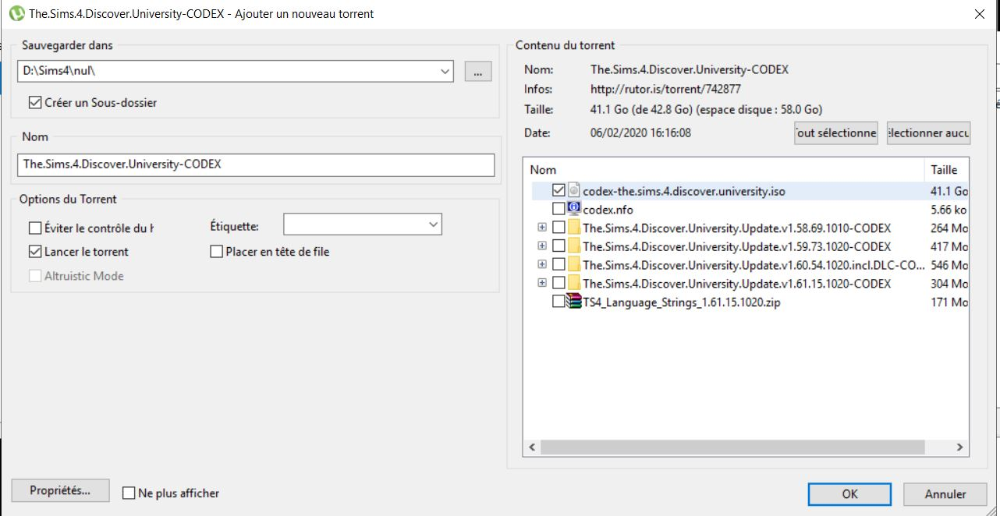

## Installation

### 1. Normalement
Tu devrais avoir cela : 

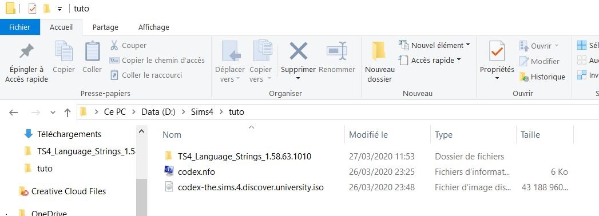

Tu clique sur `codex-the.sims.4.discover.university.iso`
Ca va te "charger le contenue du jeu comme un CD"
### 2. T'éxecute `setup.exe`
Il va te demander les droits d'administration tu lui dis ok bro je te fais confiance

### 3. Setup
Normalement le `setup.exe` t'ouvre Codex.
Tu modifies le repertoire d'installation du jeu si tu veux

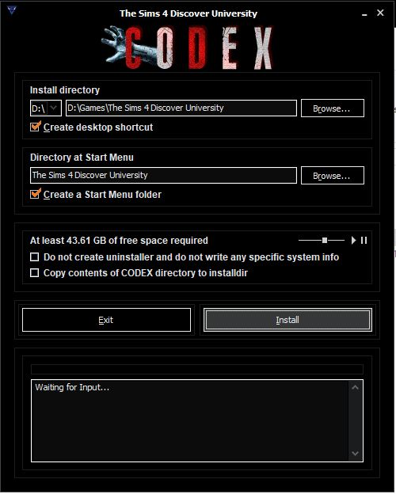

Tu coches bien `Copy contents of CODEX directory to installdir` sinon tu n'embarquera pas le patch, pas de patch, pas de Sims

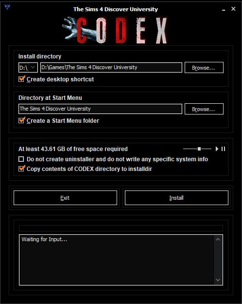

Tu cliques sur `Install` et puis t'attends (~20 min dans mon cas) t'as le temps de faire ton gouté ?

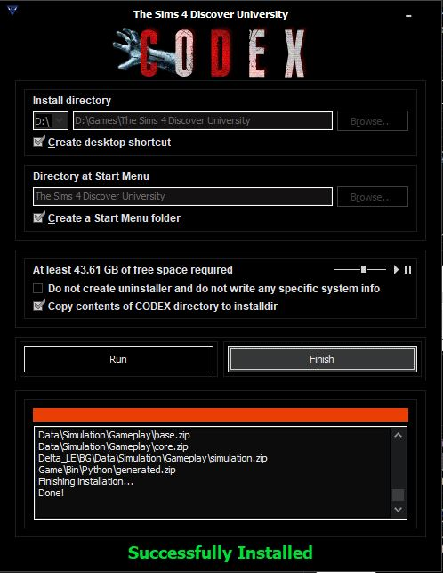

Clapclap t'as les Sims 4 pas chère. Mais en anglais english 

### 4. Changement de langue
Tu vas dans le dossier où tu a téléchargé le jeu puis dans `TS4_Language_Strings_1.58.63.1010`

Ensuite tu `Ctrl+a` pour tous sélectionner, `Ctrl+c` pour copier

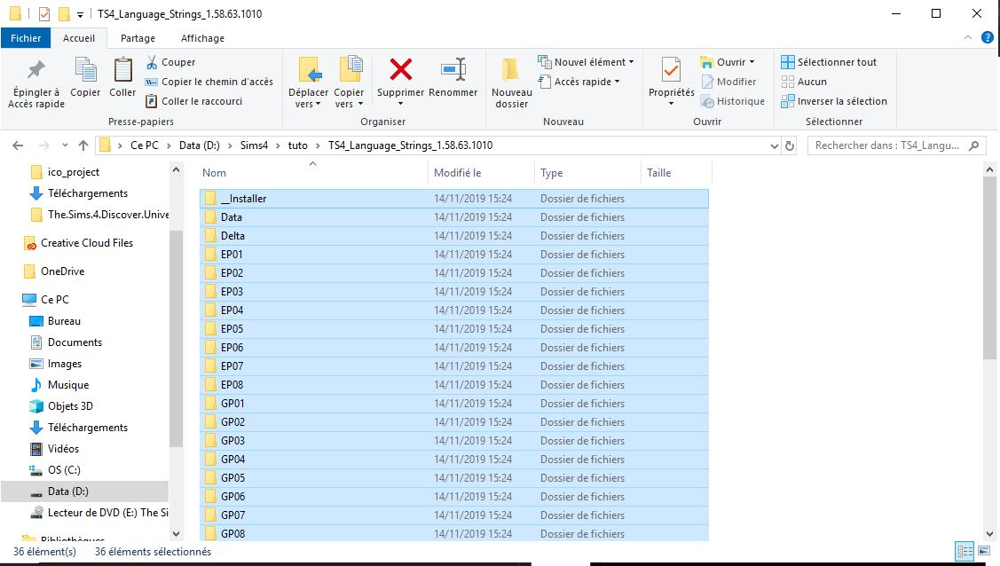

Tu vas dans le dossier où les Sims sont installés. Non t'as déjà oublié où ça a été installé...

#### 4.1 Si t'es une quiche
Tu cherches les Sims sur ton Windows, et tu clique sur `Ouvrir l'emplacement du fichier`

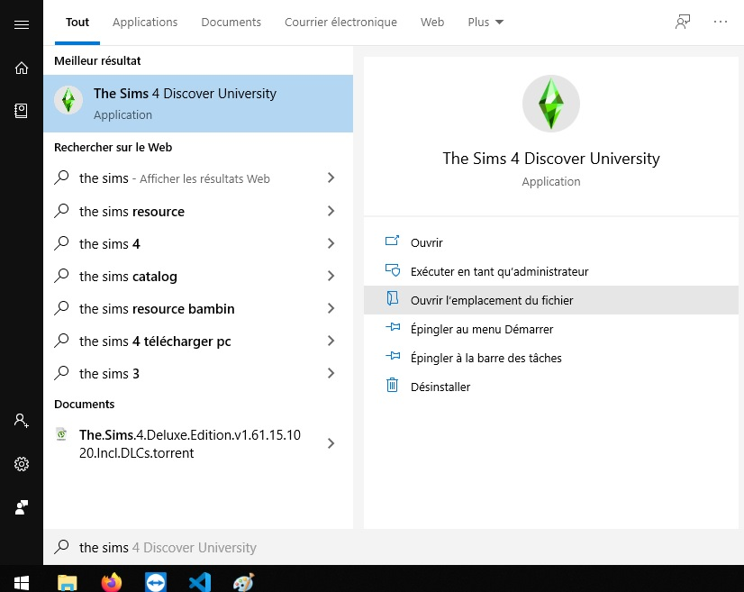

Ca va t'ouvrir une nouvelle fenêtre sur le racourcie du jeu. Tu clique droit sur le racourcie puis `Ouvrir l'emplacement du fichier`

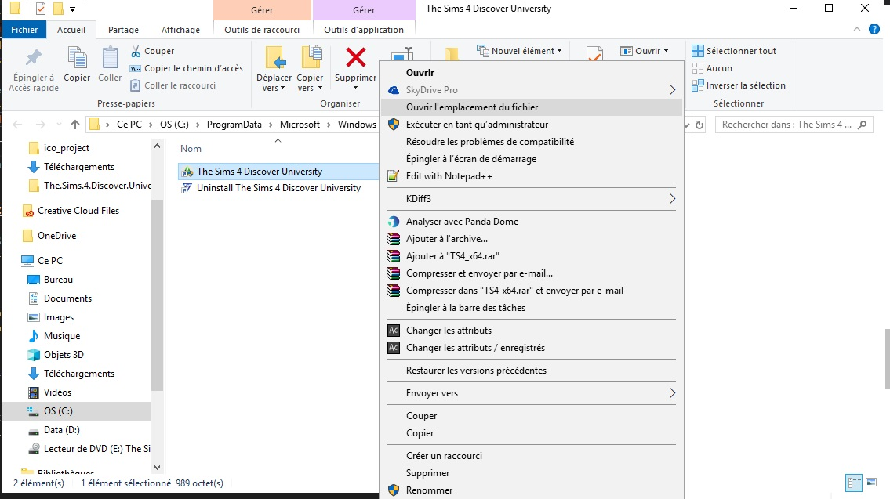

T'arrive dans le dossier du jeu !

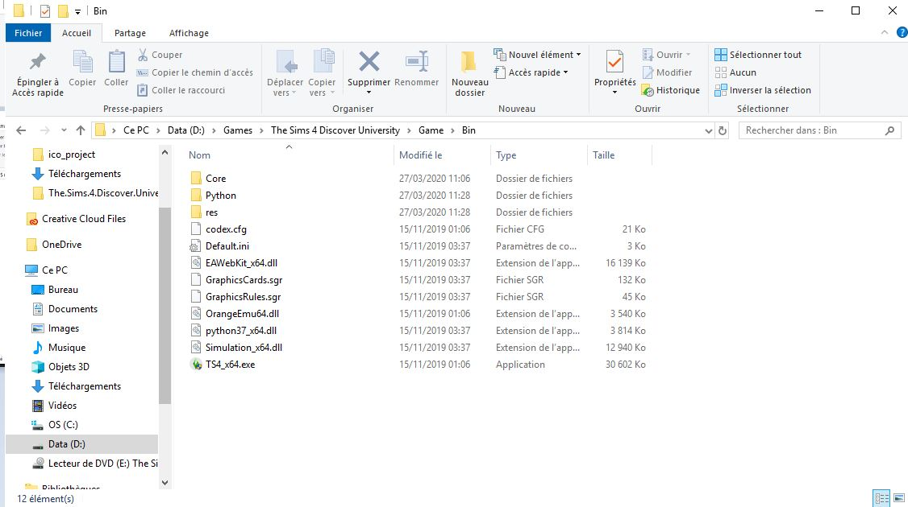

Tu remonte à la racine de ton jeu dans mon cas `D:\Games\The Sims 4 Discover University` (au lieu de `D:\Games\The Sims 4 Discover University\Game\Bin`)

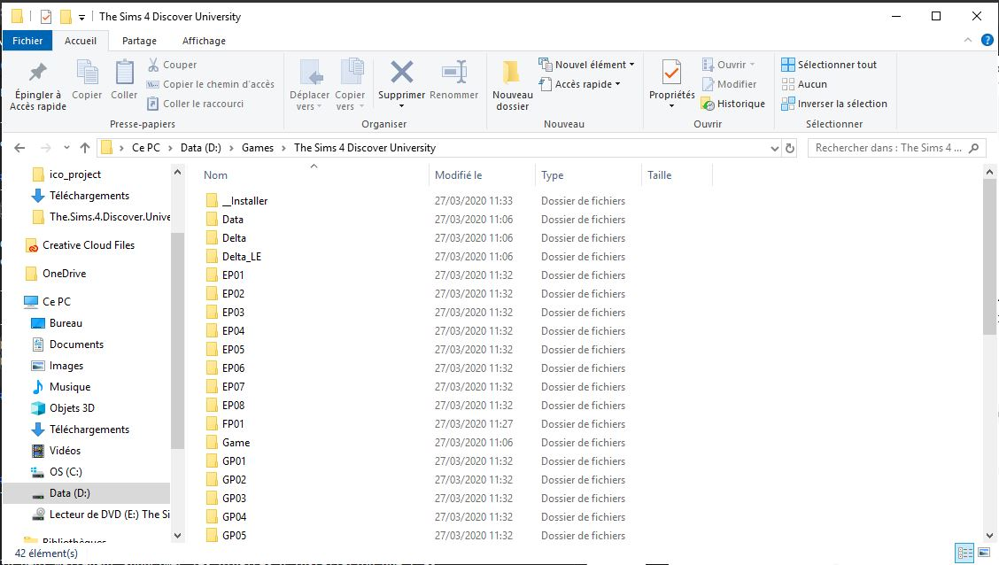

Tu devrais avoir ça si t'as réussi à lire jusqu'ici

#### 4.2 Bon on continue
Pfiou, tu colles ce que tu as copié précèdement `Ctrl+v` dans ce dossier et t'accepte de remplacer les fichiers

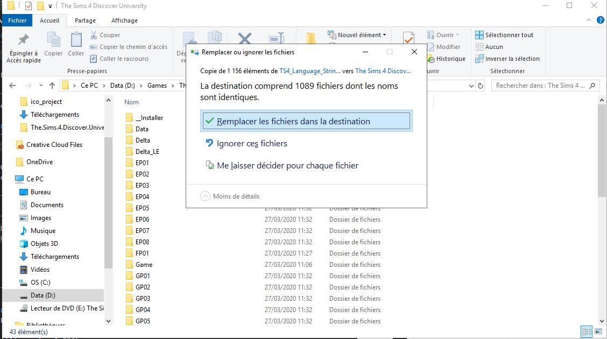

A la fin de ta copie tu devrais avoir un `EASetup.exe` dans ce dossier, tu le lances en acceptant les droits d'administration, tu change la langue et tu clique sur `Apply`

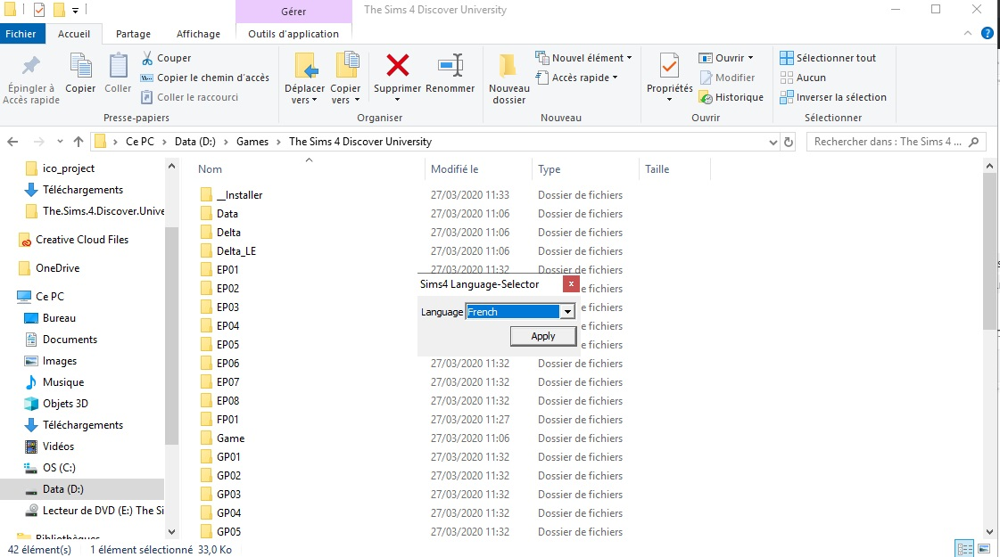

Attends un peu l'application, au bout de 2 min si elle ne c'est pas fermé dans ta barre des tâches ferme le

### 5. Nettoyage conchita
Tu enlève l'iso que tu as chargé `Ejecter`

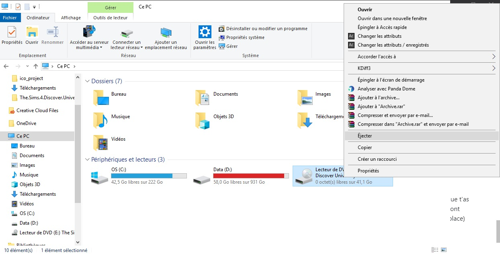

Tu peux maitenant supprimer les binaires d'installation que t'as téléchargé (dans mon cas `D:\Sims4\tuto`) vu qu'ils ne vont plus te servir (et vider ta corbeille après pour faire de la place).

### 6. Aller viens on joue !
Bon ben on peux lancer ton jeu l'enfant.

Au premier lancement tu auras cela, clique sur  `Autoriser l'accès`

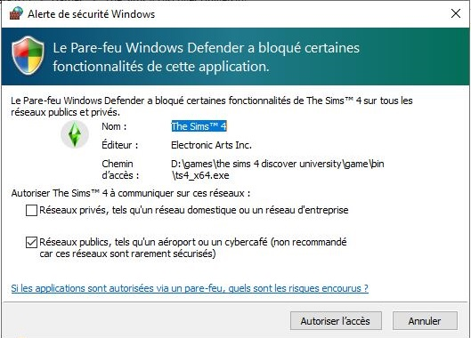

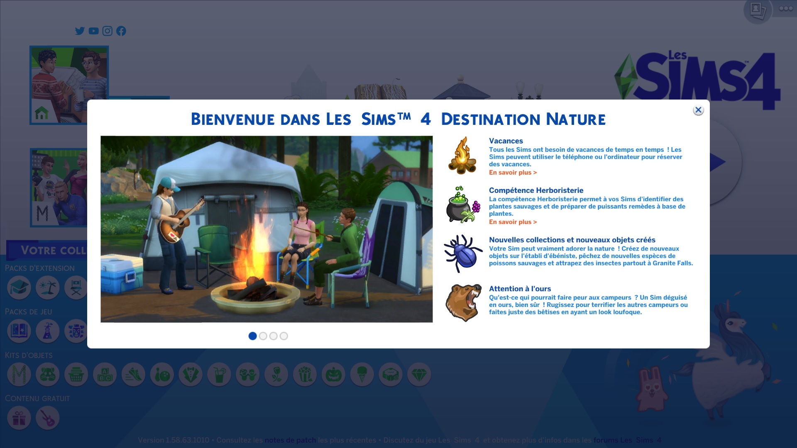

## Remerciements
**Paypal :** vincent.berthet42@gmail.com Des bisous <3
