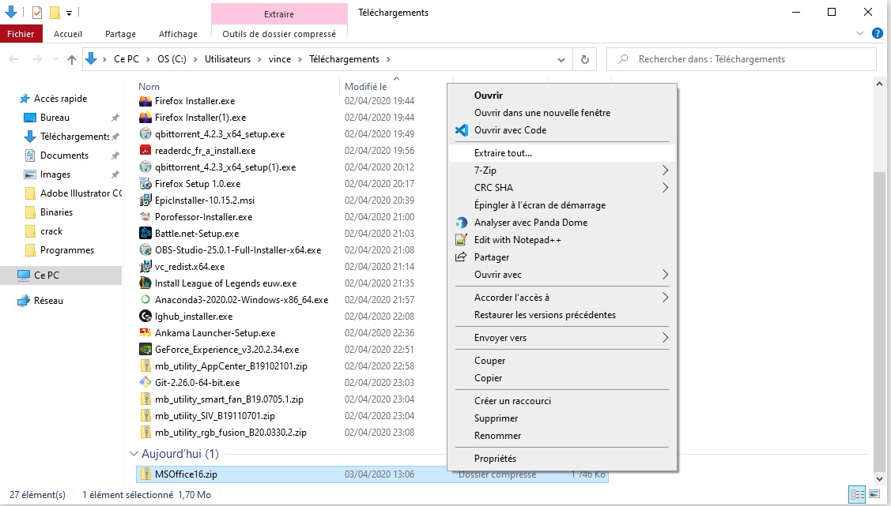
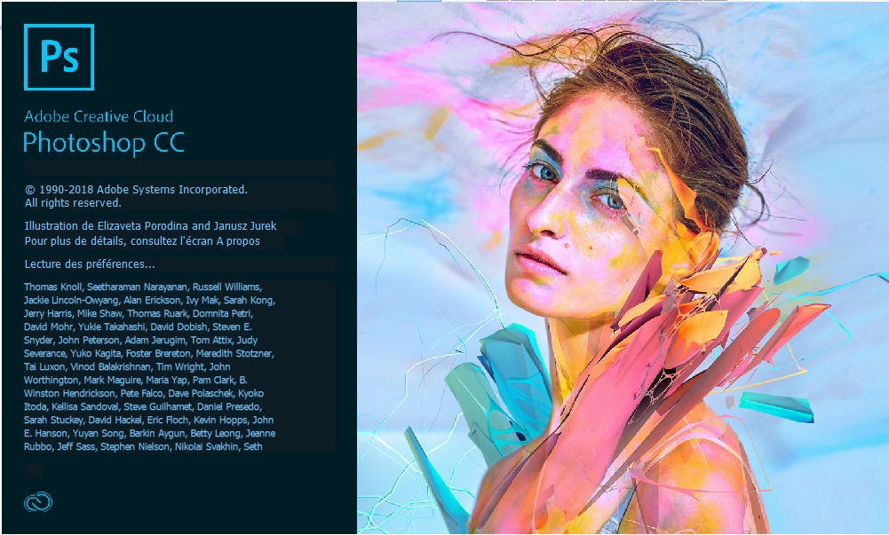
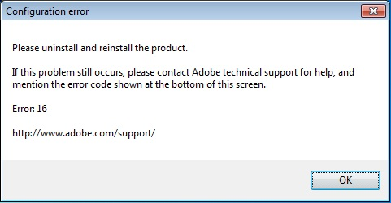
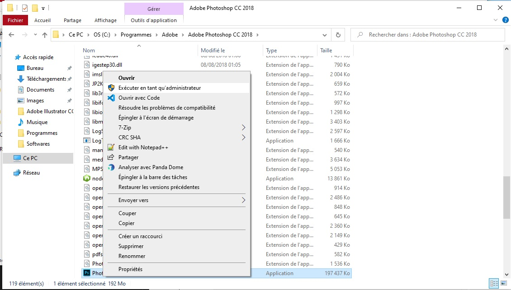
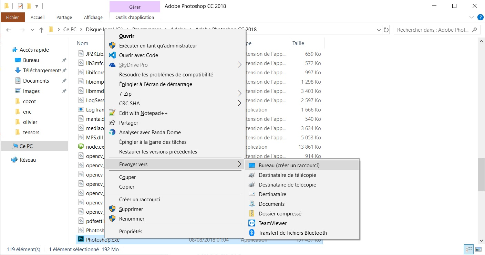
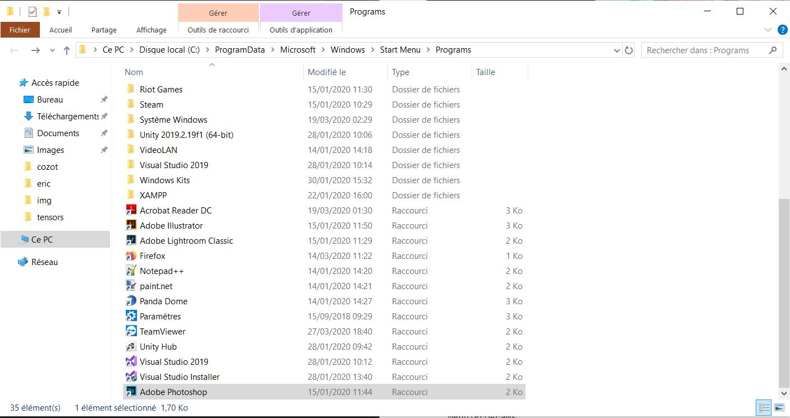
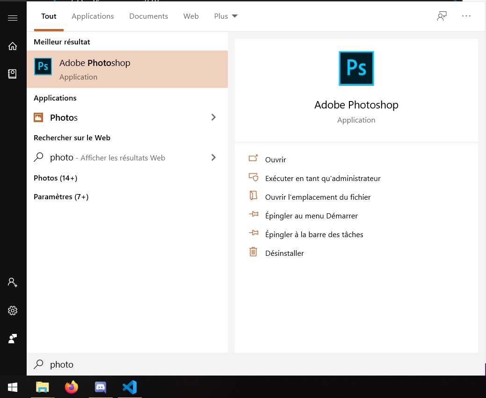

# Adobe Suite

## Téléchargement

* **Adobe Photoshop :** [Adobe.Photoshop.CC.2018.zip](https://github.com/RealVincentBerthet/Binaries/releases/download/win%2FPhotoshop/Adobe.Photoshop.CC.2018.zip) 
* **Adobe Illustrator :** [Adobe.Illustrator.CC.2018.zip](https://github.com/RealVincentBerthet/Binaries/releases/download/win%2FIllustrator/Adobe.Illustrator.CC.2018.zip)
* **Adobe Premiere :** [Adobe.PremierPro.11.zip](https://github.com/RealVincentBerthet/Binaries/releases/download/win%2FPremierePro/Adobe.PremierPro.11.zip)
* **Adobe Lightroom :** [Adobe.Lightroom.Classic.zip](https://github.com/RealVincentBerthet/Binaries/releases/download/win%2FLightroom/Adobe.Lightroom.Classic.zip) 

## Installation
### Adobe LightRoom
Juste à lancer le `setup.exe`
### Adobe Photoshop, Illustrator, Premiere
* De-zipper l'archive `.zip` télécharger

* Déplacer le dossier obtenu `Adobe Photoshop CC 2018` vers le chemin d'installation de l'application désiré, par exemple `C:\Program Files\Adobe\Adobe Photoshop CC 2018`

* Exécuter `Photoshop.exe` pour lancer le logiciel

### Si `erreur 16` 

  * Lancer une fois le programme en `mode administrateur` (clique droit+Exécuter en mode adminstrateur)

### Si `erreur *.dll`
Si `msvcp140.dll` / `VCRUNTIME140.dll` est indiqué manquant il faut installer les librairies de Microsoft `Microsoft redistribuables C++`

**Lien direct :**
* [Packages redistribuables Visual C++ pour Visual Studio 2013](https://www.microsoft.com/fr-fr/download/details.aspx?id=40784)
    * vcredist_x64.exe
    * vcredist_x86.exe

* [Package redistribuable Visual C ++ pour Visual Studio 2015, 2017 et 2019](https://support.microsoft.com/fr-fr/help/2977003/the-latest-supported-visual-c-downloads)
    * [vc_redist.x86.exe](https://aka.ms/vs/16/release/vc_redist.x86.exe)
    * [vc_redist.x64.exe](https://aka.ms/vs/16/release/vc_redist.x64.exe)

## Racourcie

Pour ajouter un racourcie dans le menu démarrer

* Créer le racourcie sur le bureau clique droit sur `Photoshop.exe` puis `Bureau (créer un racourcie)`

* Renommer le racourcie en `Adobe Photoshop`
* Déplacer la racourcie dans `C:\ProgramData\Microsoft\Windows\Start Menu\Programs`

* Tada

