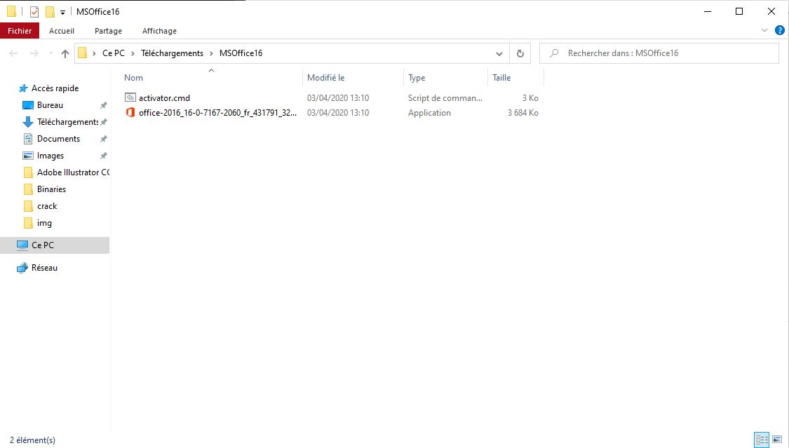
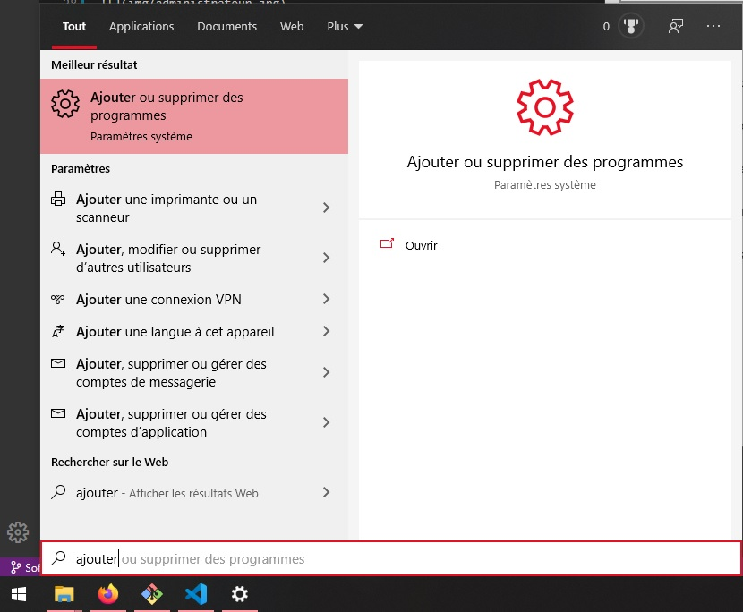
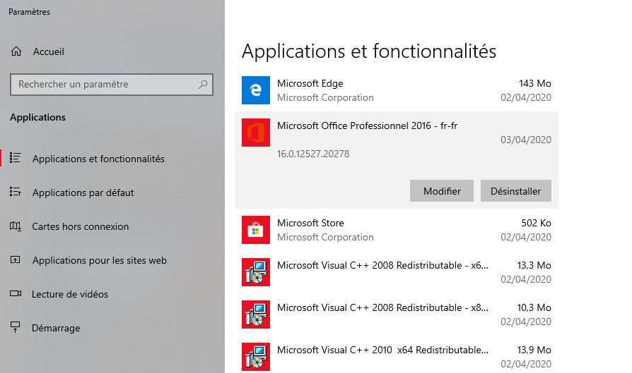
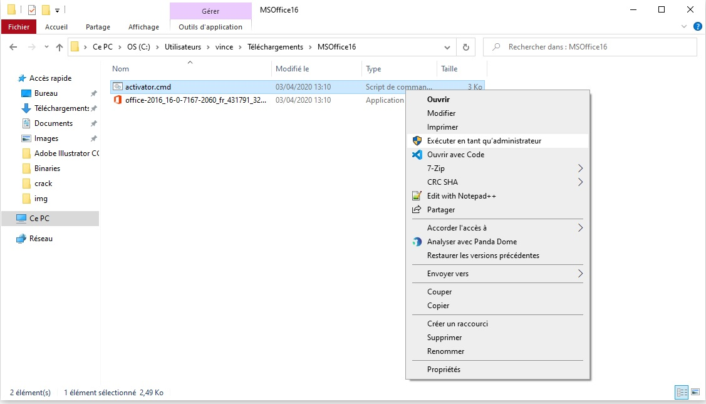
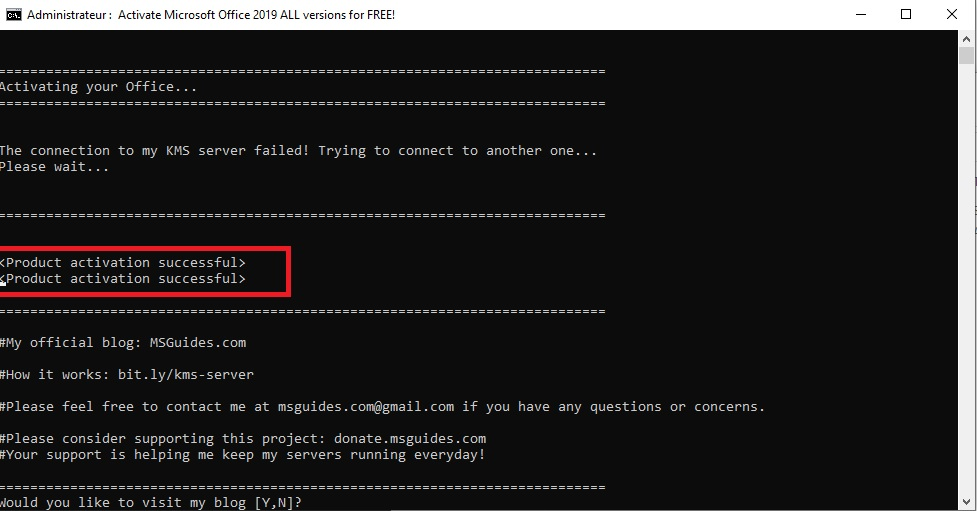
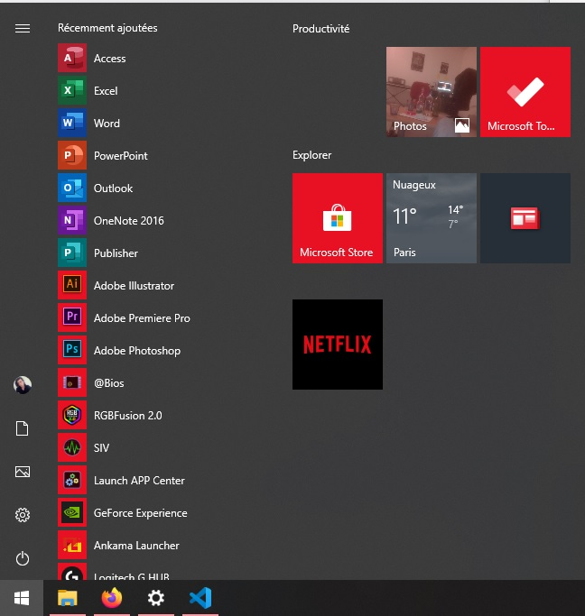
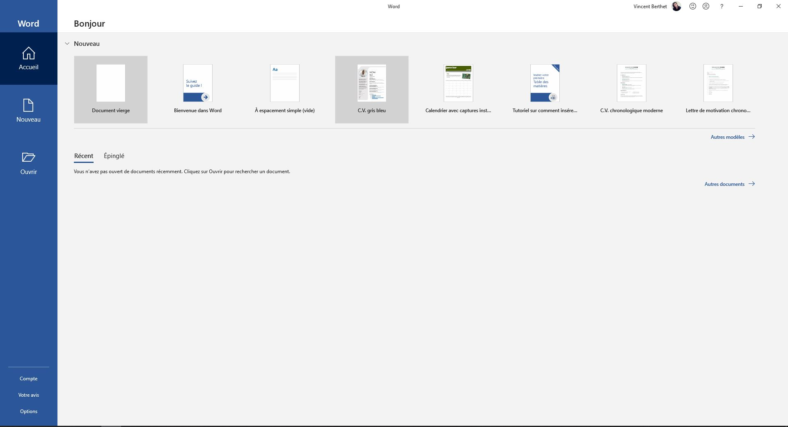

# Microsoft Office
## Téléchargement
* Télécharger [MSOffice16.zip](https://github.com/RealVincentBerthet/Binaries/releases/download/win%2FMSOffice/MSOffice16.zip) 

* Extraire l'archive obtenu `MSOffice16.zip` (clique droit+Extraire tout)

* Tu devrais avoir cela 

## Installation
### Desinstaller la version d'essai de Windows
Dans un premier temps, il va falloir supprimer toute version de Microsoft office existante. Par defaut, Windows embarque une version d'essai qu'il faut désinstaller.

* Ouvrir le gestionnaire d'application de Windows

* Desinstaller la version existante si elle existe

### Installer Microsoft Office
Pour installer la version officiel de Microsoft Office, il suffit juste d'éxécuter `office-2016_16-0-7167-2060_fr_431791_32.exe`
### Activation

* Lancer le script `activator.cmd` en `mode administrateur` (clique droit+Exécuter en tant qu'administrateur)

* Une console va se lancer, attendre la fin et **>>vérifier si l'activation a réussi<<**, tu peux ensuite quitter la console

* Plus que à lancer un programme de Microsoft Office et travaillerrrrrr

